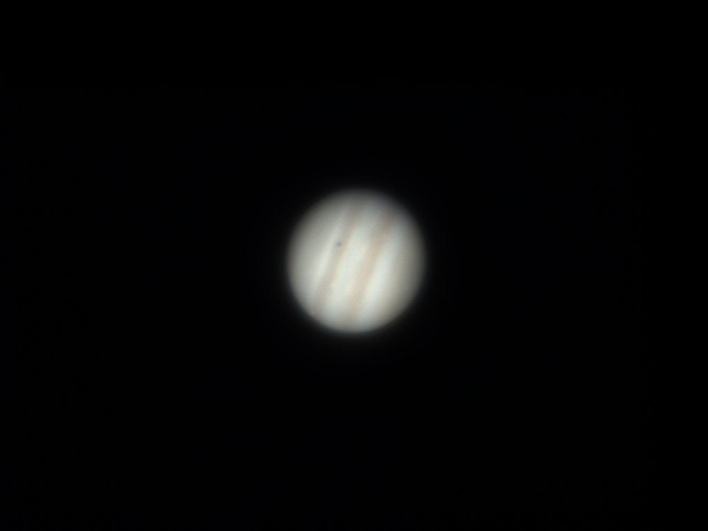

## Night Sky Gallery

Here are some of my favorite astrophotography shots:

---

Camera: ZWO ASI2600MC pro  
Equatorial Mount: Clearsky ST17  
Filter: Optolong L-Ultimate 
Frames: 11*300  
October 1, 2025 at Buffalo

---

**M13 Globular Cluster**

Camera: ZWO ASI585MC pro  
Equatorial Mount: Clearsky ST17  
Filter: Antlia IR685 
Frames: 11*300  
September 1, 2025 at Buffalo

---

**Moon (3X drizzle)**

Camera: ZWO ASI585MC pro  
Equatorial Mount: Clearsky ST17  
Filter: Antlia IR685  
2025 summer at Buffalo

---

**Pillars of Creation**

Camera: ZWO ASI585MC pro  
Equatorial Mount: Clearsky ST17  
Filter: ZWO 1.25" Duo-Narrowband Filter  
Frames: 50*300  
2025 summer at Buffalo

---

**Pelican Nebula**

Camera: ZWO ASI585MC pro  
Equatorial Mount: Clearsky ST17  
Filter: ZWO 1.25" Duo-Narrowband Filter  
Frames: 22*300  
2025 summer at Buffalo

---

**M33** 

Telescope: Sky-watcher quattro 150P  
Camera: ZWO ASI585MC pro  
Equatorial Mount: Clearsky ST17  
Filter: ZWO 1.25" Duo-Narrowband Filter  
Frames: 29*300  
22th Dec 2024 at Buffalo

---

**The Great Orion Nebula** 

Telescope: Sky-watcher quattro 150P  
Camera: ZWO ASI585MC pro  
Equatorial Mount: Clearsky ST17  
Filter: ZWO 1.25" Duo-Narrowband Filter  
Frames: 25\* 60; 20\* 300; 14\*600  
13th Dec 2024 at Buffalo

---

**h & χ Persei** 

Telescope: Sky-watcher quattro 150P  
Camera: ZWO ASI585MC pro  
Equatorial Mount: Clearsky ST17  
Filter: ZWO 1.25" Duo-Narrowband Filter  
Frames: 15*180  
13th Dec 2024 at Buffalo

---

**M81 & M82** 

Telescope: Sky-watcher quattro 150P  
Camera: ZWO ASI585MC pro  
Equatorial Mount: Clearsky ST17  
Filter: ZWO 1.25" Duo-Narrowband Filter  
Frames: 18*300  
13th Dec 2024 at Buffalo

---

**The Crab Nebula (M1)** is a supernova remnant located in the constellation Taurus, approximately 6,500 light-years away from Earth. The supernova explosion that created the Crab Nebula was observed and recorded by ancient Chinese astronomers: In 1054 AD, a “guest star” (客星) suddenly appeared in the sky. This guest star was visible even during the day for 23 days and at night for almost two years. 

Telescope: Sky-watcher quattro 150P  
Camera: ZWO ASI585MC pro  
Equatorial Mount: Sky-watcher SA GTI  
Filter: ZWO 1.25" Duo-Narrowband Filter  
Frames: 31*300  
8th Nov 2024 at Buffalo

---

**Horsehead Nebula (IC 434)** 

Telescope: Sky-watcher quattro 150P  
Camera: ZWO ASI585MC pro  
Equatorial Mount: Sky-watcher SA GTI  
Filter: ZWO 1.25" Duo-Narrowband Filter  
Frames: 37*300  
1st Nov 2024 at Buffalo

---

**Triangulum Galaxy (M33)** 

Telescope: Sky-watcher quattro 150P  
Camera: ZWO ASI585MC pro  
Equatorial Mount: Sky-watcher SA GTI  
Filter: ZWO 1.25" Duo-Narrowband Filter  
Exposure time: 6000s  
10th Oct 2024 at Buffalo

---

**Caldwell 30 & Stephan's Quintet** 

Telescope: Sky-watcher quattro 150P  
Camera: ZWO ASI585MC pro  
Equatorial Mount: Sky-watcher SA GTI  
Filter: ZWO 1.25" Duo-Narrowband Filter  
Exposure time: 3000s  
10th Oct 2024 at Buffalo

---

**Andromeda Galaxy (M31)** is 2.5 million light-years away from us and is the closest galaxy to our Milky Way. In 1764, it was cataloged as the 31st entry in the Messier Catalog of star clusters and nebulae by the astronomer Messier, hence the name M31. The white bright spot on the left side of M31 is a dwarf galaxy called M32, which has been captured by M31's gravity. 

Telescope: Sky-watcher quattro 150P  
Camera: ZWO ASI585MC pro  
Equatorial Mount: Sky-watcher SA GTI  
Filter: ZWO 1.25" Duo-Narrowband Filter  
Exposure time: 4500s  
6th Oct 2024 at Buffalo

---

**The Pleiades (M45)** is one of the most famous open star clusters in the night sky, known for its compact and bright stars. Located approximately 444 light-years from Earth, the Pleiades formed around 100 million years ago, making it a young star cluster. The blue reflection nebula surrounding the cluster is created by the starlight being reflected off the surrounding dust clouds. Due to the camera's sensor size limitation, I can only capture a part of it.  

Telescope: Sky-watcher quattro 150P  
Camera: ZWO ASI585MC pro  
Equatorial Mount: Sky-watcher SA GTI  
Filter: ZWO 1.25" Duo-Narrowband Filter  
Exposure time: 2700s  
6th Oct 2024 at Buffalo

---

**Moon eclipse** 

Telescope: Celestron 130eq  
Camera: ZWO ASI585MC pro  
18th Sep 2024 at Buffalo

---

**Full Moon in Mid-autumn festival** 

Telescope: Celestron 130eq  
Camera: ZWO ASI585MC pro  
17th Sep 2024 at Buffalo

---

**Jupiter** Telescope: Celestron 130eq  
Camera: ZWO ASI585MC pro  
15th Sep 2024 at Buffalo

---

**Colorful Moon** 

Telescope: Celestron 130eq  
Camera: ZWO ASI585MC pro  
21st Aug 2024 at Buffalo

---

## My equipments

Telescopes

  * Celestron 130eq 
  * Sky-Watcher 150p Newtonian
  * Skyrover 50SAW 
  
Mounts

  * Clearsky 17st
  * Sky-Watcher SA gti
  
Cameras

  * ZWO ASI2600MC pro
  * ZWO ASI585MM pro
  * ZWO ASI585MC pro
  * ZWO ASI120mini
  * Touptek GPM662M
  
Filters

  * Broadband filters: Optolong UV/IR cut, Optolong IR685, Antlia IR685, Antlia R+ (700-1000nm), Antlia V pro RGB, XIMEI Custom 700-800nm, XIMEI Custom 825-875nm
  * Narrowband filter: ZWO Duo-Band, HYO Duo-Narrowband, Optolong L-Ultimate, XIMEI SII (3nm) 
